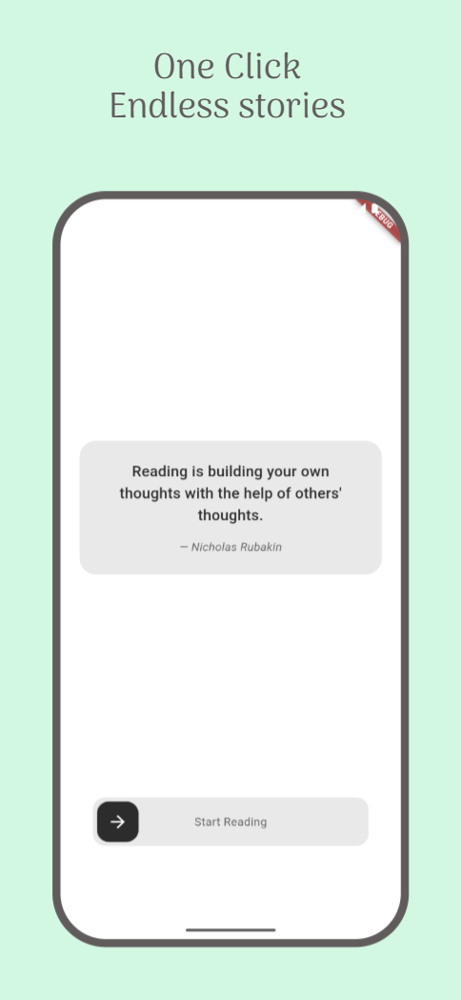
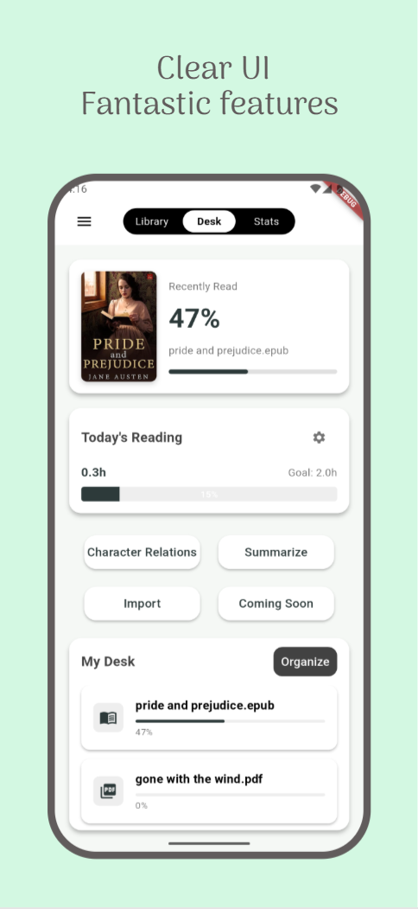
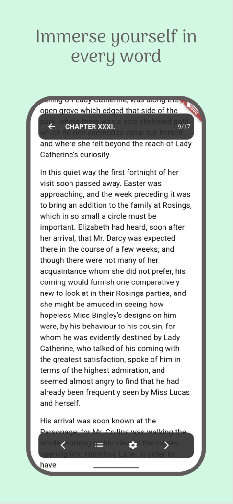
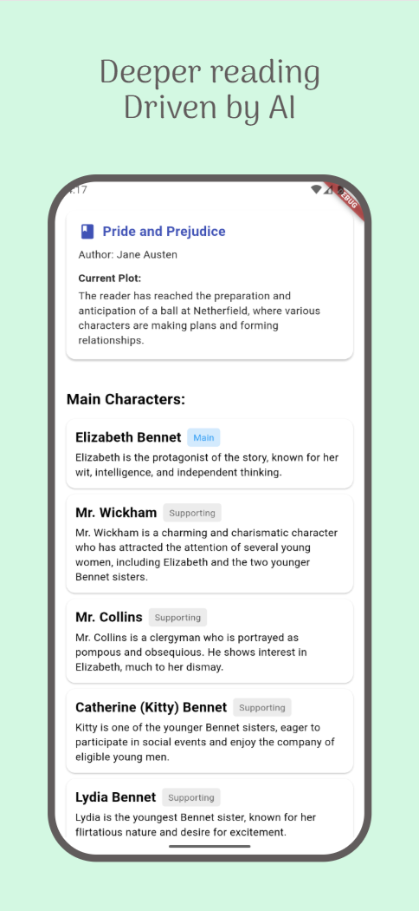
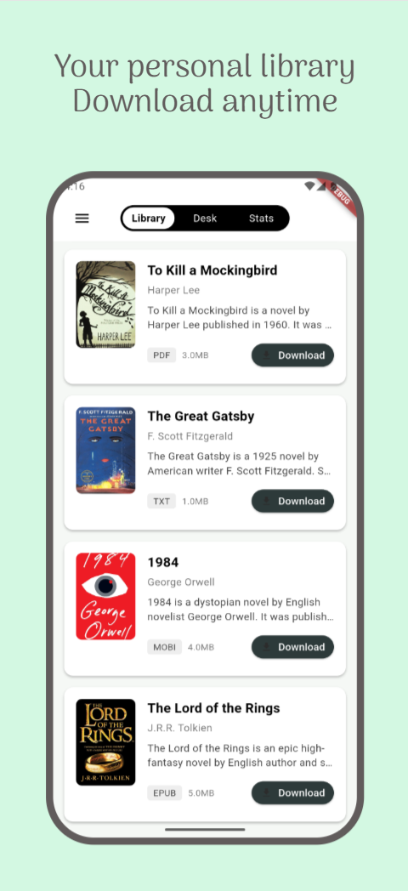
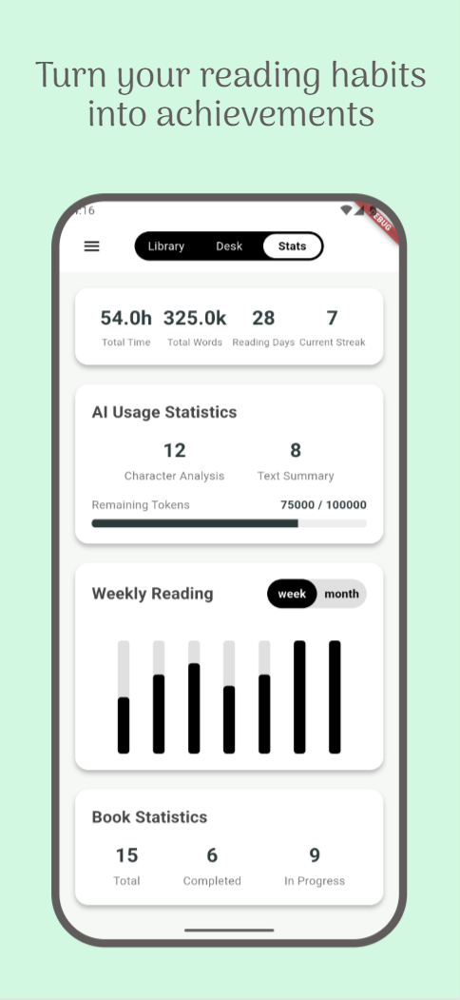
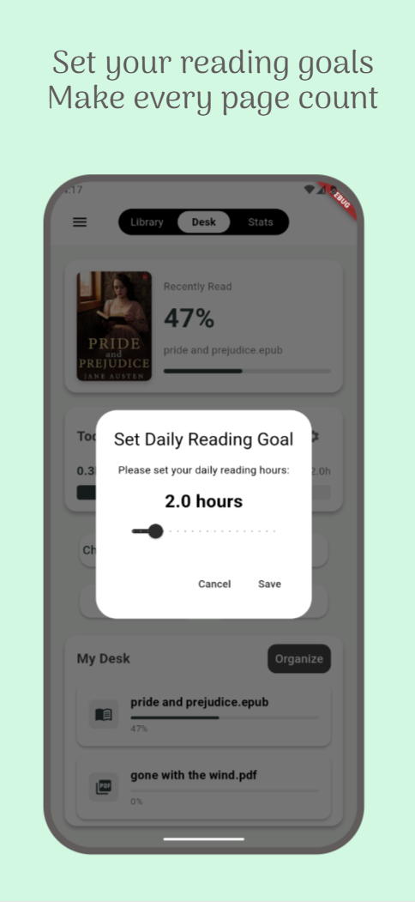

# Reader App | 阅读应用

  

  <a href="#-english">English</a> | 
  <a href="#-中文">中文</a>

---

## 🎨 Clear UI
Reader App is a sophisticated e-book reader that transforms your reading experience with powerful AI-driven features. Designed for book lovers who want to get more from their reading, our app combines elegant design with cutting-edge technology.

## ✨ Fantastic Features
Read all your favorite books in one place with support for multiple formats:
- **PDF** - Perfect rendering with smooth scrolling
- **EPUB** - Beautiful page turning with customizable themes
- **TXT** - Clean and simple text reading experience
- **MOBI** - Automatic conversion to compatible formats

  

## 📖 Immerse Yourself in Every Word
Enjoy a distraction-free reading environment:
- **Elegant Interface** - Clean, minimalist design
- **Customizable Themes** - Choose the perfect reading mode for any time of day
- **Inspirational Quotes** - Start your reading session with literary wisdom
- **Intuitive Navigation** - Easily move between books and features

  

## 🧠 Deeper Reading Driven by AI
Unlock deeper understanding of your books:
- **Character Relationship Analysis** - Visualize connections between characters
- **Text Summarization** - Get concise summaries of what you've read
- **Smart Bookmarks** - AI remembers context around your bookmarks

  

## 📚 Your Personal Library
Organize your collection effortlessly:
- **Virtual Bookshelf** - Beautiful visual representation of your books
- **Auto-Import** - Easily add books from your device
- **Reading Progress Tracking** - Resume exactly where you left off
- **Recently Read** - Quick access to books you're currently enjoying

  

## 📊 Turn Your Reading Habits into Achievements
Track your reading habits with beautiful visualizations:
- **Reading Time** - See how much time you spend reading daily, weekly, and monthly
- **Reading Progress** - Track completion across your entire library
- **Reading Streaks** - Stay motivated with streak tracking
- **Word Count** - Monitor how many words you read

  

## 🎯 Set Your Reading Goals, Make Every Page Count
Smart features for serious readers:
- **Reading Goals** - Set and track daily reading targets
- **Reading History** - Visualize your reading patterns over time
- **AI Token Management** - Monitor your usage of AI features

  

## 🚀 Getting Started
1. **Import Books** - Add books from your device with a single tap
2. **Organize Your Desk** - Arrange your virtual bookshelf
3. **Start Reading** - Dive into your books with our beautiful reader
4. **Explore AI Features** - Analyze characters and get summaries as you read

## 📱 Download Anytime
Transform your reading experience with Reader App - where traditional reading meets artificial intelligence.

*Reader App: Read Smarter, Understand Deeper*

---

## 🎨 清晰界面
阅读应用是一款精致的电子书阅读器，通过强大的AI驱动功能改变您的阅读体验。专为希望从阅读中获取更多收获的书籍爱好者设计，我们的应用将优雅的设计与前沿技术相结合。

## ✨ 精彩功能
在一处阅读您所有喜爱的书籍，支持多种格式：
- **PDF** - 完美渲染，平滑滚动
- **EPUB** - 精美翻页效果，可定制主题
- **TXT** - 清晰简洁的文本阅读体验
- **MOBI** - 自动转换为兼容格式

  

## 📖 沉浸于每一个字
享受无干扰的阅读环境：
- **优雅界面** - 干净、极简设计
- **可定制主题** - 为任何时间选择完美的阅读模式
- **励志名言** - 以文学智慧开始您的阅读会话
- **直观导航** - 在书籍和功能之间轻松切换

  

## 🧠 AI驱动的深度阅读
深入理解您的书籍：
- **人物关系分析** - 可视化角色之间的联系
- **文本摘要** - 获取您已阅读内容的简明摘要
- **智能书签** - AI记住书签周围的上下文

  

## 📚 您的个人图书馆
轻松组织您的收藏：
- **虚拟书架** - 书籍的精美视觉展示
- **自动导入** - 轻松从设备添加书籍
- **阅读进度跟踪** - 从您上次离开的地方继续阅读
- **最近阅读** - 快速访问您当前正在阅读的书籍

  

## 📊 将阅读习惯转化为成就
通过精美的可视化追踪您的阅读习惯：
- **阅读时间** - 查看您每天、每周和每月的阅读时间
- **阅读进度** - 跟踪整个书库的完成情况
- **阅读连续性** - 通过连续阅读记录保持动力
- **字数统计** - 监控您阅读了多少字

  

## 🎯 设定阅读目标，让每一页都有价值
为认真读者提供的智能功能：
- **阅读目标** - 设置并跟踪每日阅读目标
- **阅读历史** - 可视化您的阅读模式随时间的变化
- **AI令牌管理** - 监控您对AI功能的使用情况

  

## 🚀 开始使用
1. **导入书籍** - 一键从设备添加书籍
2. **整理书桌** - 安排您的虚拟书架
3. **开始阅读** - 使用我们精美的阅读器深入您的书籍
4. **探索AI功能** - 在阅读时分析角色并获取摘要

## 📱 随时下载
使用阅读应用改变您的阅读体验 - 传统阅读与人工智能的完美结合。

*阅读应用：更智能地阅读，更深入地理解*
